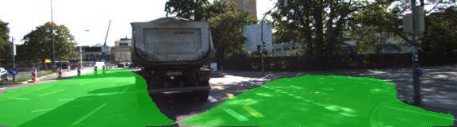

# CarND-Semantic-Segmentation-Project
Self-Driving Car Engineer Nanodegree Program
   

## Introduction
The purpose of the project is to label the pixels of a road in images using Fully Convolutional Network (FCN). The network architecture used here is a FCN-8 structure. Basically, it implements the same network architecture that is described in the paper [Fully Convolutional Networks for Semantic Segmentation](https://people.eecs.berkeley.edu/~jonlong/long_shelhamer_fcn.pdf) by Jonathan Long, Evan Shelhamer and Trevor Darrell from UC Berkeley. 


## Model

Most of the code is inside main.py run method. The code downloads a pre-trained frozen VGG16 model in helper.py. The model can be found [here](https://s3-us-west-1.amazonaws.com/udacity-selfdrivingcar/vgg.zip). Then we extract the input, keep probability, layer 3, layer 4 and layer 7 from it in procedure [load_vgg](./main.py#L24). Those layers are used in the procedure [layers](./main.py#L54) to create the rest of the network.

First we have added 1x1 convolutions to layer 7 to reduce the number of classes to 2 ("road" and "not road") and then upsampled it by transposed convolutions back to the original image size. Two skip layers are connected from layer 3 ("pool3") and layer 4 ("pool4") to improve the upscaled classification resolution. Given below in the tensorboard image of the tensorflow graph.


Every created convolutional and transpose convolutional layer uses a random-normal kernel initializer with standard deviation 0.01 and a L2 kernel regularizer with value 0.001.

Once the network structure is defined, the optimizer and the cross-entropy lost is defined in the procedure [optimize](./main.py#L116) using Adam optimizer. As suggested in Udacity tips for the project the l2 regularization loss is added to cross entropy loss.

The network in then trained with keep probability 0.5 and learning rate 0.001 for KITTI dataset for 50 epochs with batchsize as 5.


## Dataset
The data set used to train the model is [Kitti Road dataset](http://www.cvlibs.net/datasets/kitti/eval_road.php) and can be downloaded from [here](http://www.cvlibs.net/download.php?file=data_road.zip).  Extract the dataset in the `data` folder.  This will create the folder `data_road` with all the training a test images.

## How to run

### Prerequisites
Make sure to have the following installed:
 - [Python 3](https://www.python.org/)
 - [TensorFlow](https://www.tensorflow.org/)
 - [NumPy](http://www.numpy.org/)
 - [SciPy](https://www.scipy.org/)
 
### GPU 

The file `main.py` will check to make sure you are using GPU - if you don't have a GPU on your system, you can use AWS or another cloud computing platform. I have used a Spot instance on AWS following the procedure explained in the class with the Udacity's udacity-cardn-advanced-deep-learning Comunity AMI. The instance type was g3.4xlarge. 

### Running the model
Run the following command to execute the project:
```
python main.py -mode [0|1|2]

mode 0 - train the model and then save it
mode 1 - load the saved model and run on test images
mode 2 - load the saved model and create a video
```

## Results

### Images

In most of the test images the netwrok was able to detect road properly. But, there were some images where detection was poor. Given below are some good and bad detection examples:

#### Good example


#### Poor example




### Video
The network is applied in Udacity test video from lane detection project. The output video can be found [here](./video/project_video_out.mp4). The network was able to reasonably detect road in the video but it requires lot of improvement. Need to train the network on bigger database and then try again.


